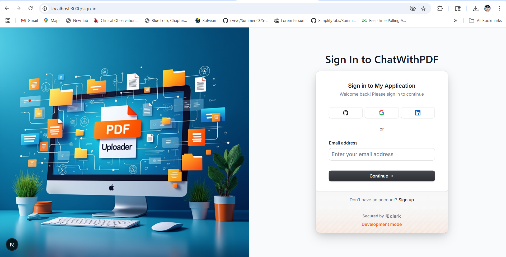
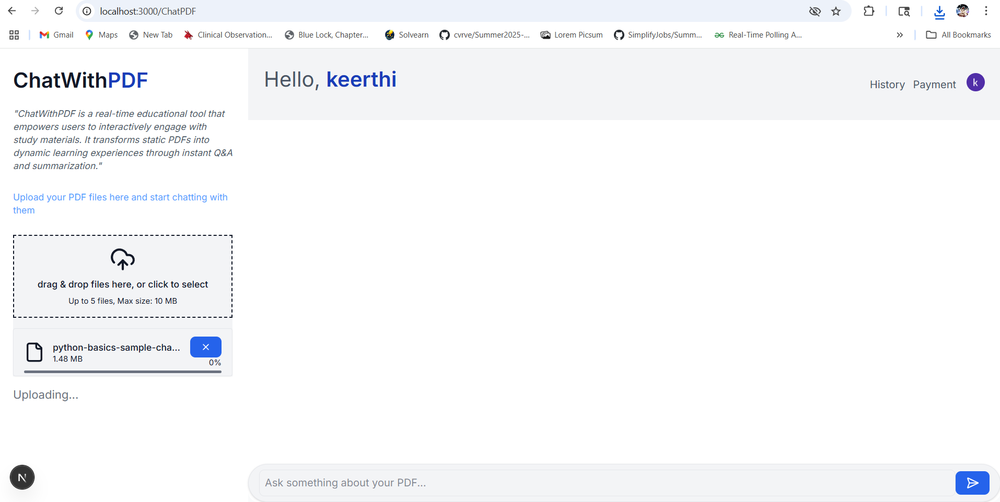
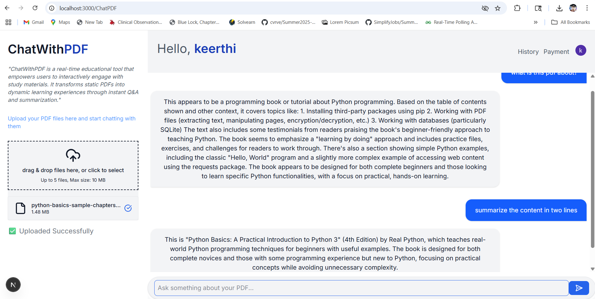
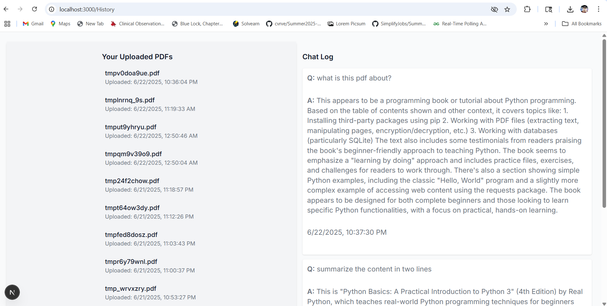

📄 ChatWithPDF – AI-Powered Document Assistant  
Create personalized tutoring sessions by uploading PDFs and asking questions. Built with Flask, Next.js, LangChain, and Anthropic, this cross-platform EdTech AI app enables real-time interactions over study materials.

---

## 📚 Table of Contents
- 🤖 Introduction
- ⚙️ Tech Stack
- 🔋 Features
- 🚀 Getting Started
- 🔗 Assets
- 🌄 Screenshots
- 🧪 Live Demo
- 🔮 Future Improvements
- 📌 License
- 👤 Author

---

## 🤖 Introduction

**ChatWithPDF** is an interactive document chat platform where users can upload up to **5 PDFs per session**, get instant summaries, and ask context-aware questions using RAG (Retrieval-Augmented Generation). It is designed for **students and self-learners** to deeply engage with digital study material.

Authentication is powered by Clerk, with vector DB storage and AI responses served using LangChain and Anthropic APIs. Supabase is used for storing PDF metadata and chat history, and Redis is used to enforce query rate limits.

⚠️ This project was built as part of my advanced Python coursework and learning journey using LangChain and Flask integration with modern frontend stacks.

---

## ⚙️ Tech Stack

| Area           | Technology Used                                        |
|----------------|--------------------------------------------------------|
| Frontend       | Next.js 14, React, Tailwind CSS, Shadcn UI             |
| Backend        | Flask (Python), Supabase (PostgreSQL), Redis           |
| Authentication | Clerk (JWT-based auth)                                 |
| AI & Embeddings| LangChain, SentenceTransformers (`all-MiniLM-L6-v2`)   |
| LLM            | Anthropic Claude API                                   |
| File Storage   | Edgestore                                              |
| Rate Limiting  | Redis with Flask Limiter                               |
| Dev Tools      | Axios, Vercel, Postman, GitHub, Python-dotenv          |

---

## 🔋 Features

✅ **Upload & Chat with PDFs** – Ask questions or request summaries from uploaded documents  
📄 **Multiple PDFs** – Upload and chat with up to 5 PDFs per session  
🔐 **Authentication** – Clerk-secured login system  
💬 **Vector Search** – Uses embeddings for document chunking and contextual responses  
🧠 **RAG Pipeline** – Combines vector DB and LLM for accurate answers  
📌 **History & Logs** – Browse previous chats and uploaded PDF logs  
📊 **Rate Limiting** – Redis-based control to prevent abuse  
📱 **Responsive UI** – Seamlessly works on all screen sizes  
🛠 **Cross-Domain Integration** – Secure and efficient API communication between Flask and Next.js  
🔍 **Search** – Find your documents or previous sessions  
🧑‍💻 **Developer-Friendly** – Modular and well-structured codebase

---

## 🚀 Getting Started

### ✅ Prerequisites

- Node.js and npm
- Python 3.9+
- Git
- Accounts for:
  - [Supabase](https://supabase.com)
  - [Clerk](https://clerk.com)
  - [Edgestore](https://edgestore.dev)
  - [Anthropic](https://www.anthropic.com)
  - (Optional) Redis and Vercel

---

### 📦 Installation

#### Frontend (Next.js)

```bash
git clone https://github.com/Chakrikeerthi9/ChatWithPDF.git
cd ChatWithPDF/frontend
npm install
```

#### Backend (Flask)

```bash
cd ../backend
python -m venv venv
source venv/bin/activate  # On Windows: venv\Scripts\activate
pip install -r requirements.txt
```

---

### ⚙️ Environment Setup

Create `.env` files in both `/frontend` and `/backend` folders.

#### 🔑 Frontend `.env` Example

```env
NEXT_PUBLIC_CLERK_PUBLISHABLE_KEY=
NEXT_PUBLIC_SUPABASE_URL=
NEXT_PUBLIC_SUPABASE_ANON_KEY=
NEXT_PUBLIC_EDGESTORE_URL=
NEXT_PUBLIC_BACKEND_API_URL=http://localhost:5000
```

#### 🔐 Backend `.env` Example

```env
SUPABASE_URL=
SUPABASE_SERVICE_KEY=
CLERK_SECRET_KEY=
ANTHROPIC_API_KEY=
REDIS_URL=
```

---

### 🏃 Run the App

#### Backend
```bash
cd backend
flask run
```

#### Frontend
```bash
cd frontend
npm run dev
```

Then open [http://localhost:3000](http://localhost:3000) in your browser.

---

## 🔗 Assets

- Illustrations via Lucide Icons, Open Source SVGs
- Embeddings via `sentence-transformers/all-MiniLM-L6-v2`
- UI built using:
  - Tailwind CSS
  - `shadcn/ui`
- Voice & LLM responses powered by:
  - Anthropic Claude
  - LangChain + Flask API

---

## 🌄 Screenshots
📍 **Home Page**  


📍 **PDF Upload Interface**  


📍 **Chat with AI Tutor**  


📍 **History & Logs Page**  


---

## 🧪 Live Demo

👉 [Live Site](Under Deployment Phase)  
🔁 Backend API hosted on Render

---

## 🔮 Future Improvements

- 💳 Stripe payment gateway for premium features  
- ⏳ Advanced rate limiting per user (free vs. premium)  
- 🧾 Enhanced chat history filtering by document or date  
- 🗃️ Integration with Google Drive or Notion  
- 🔔 Email alerts for session summaries  
- 🧠 Tutor memory for better context retention across sessions

---

## 📌 License

This project is built for **educational and demonstration** purposes.  
You're free to fork, enhance, or adapt with attribution to tutorials and tools used.

---

## 👤 Author

**Keerthi Chakri** – Full Stack AI Engineer  
🔗 [LinkedIn](https://www.linkedin.com/in/chakri-keerthi-66246633b/)  
💻 [GitHub](https://github.com/Chakrikeerthi9/)  
🌐 [Portfolio](https://portfoio-8chl.vercel.app/)

---

⬆️ [Back to Top](#chatwithpdf--ai-powered-document-assistant)
